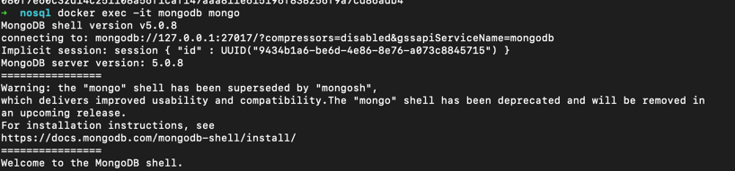
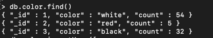
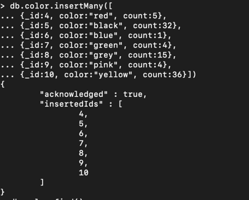
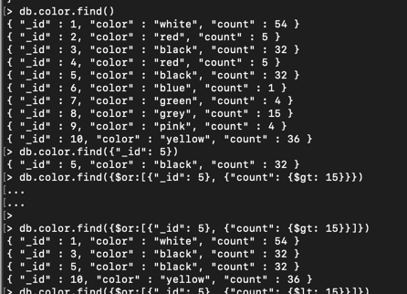
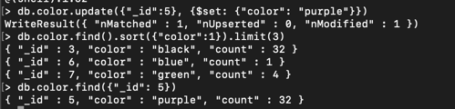

# mongodb

1. Установлен MongoDb с помощью docker
````bash
docker pull mongo
docker run -it --rm --name mongodb -d mongo
docker exec -it mongodb mongo
````


2. Заполнена данными
````bash
db.color.insertOne({_id:1, color:"white", count:54})
db.color.insertMany([{_id:2, color:"red", count:5}, {_id:3, color:"black", count:32}])
````


````bash
db.color.insertMany([{_id:4, color:"red", count:5},
{_id:5, color:"black", count:32},
{_id:6, color:"blue", count:1},
{_id:7, color:"green", count:4},
{_id:8, color:"grey", count:15},
{_id:9, color:"pink", count:4},
{_id:10, color:"yellow", count:36}])
````


3. Выборка и обновление данных
````bash
db.color.find()
db.color.find({"_id": 5})
db.color.find({$or:[{"_id": 5}, {"count": {$gt: 15}}})
````


````bash
db.color.update({"_id":5}, {$set: {"color": "purple"}})
````
